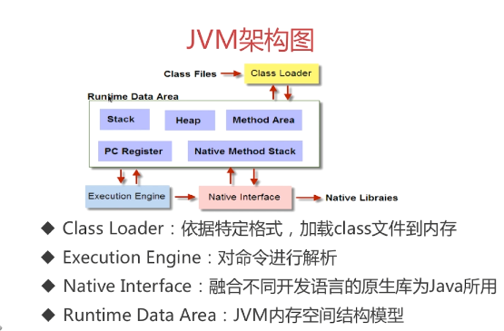
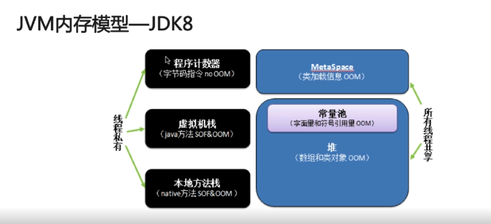
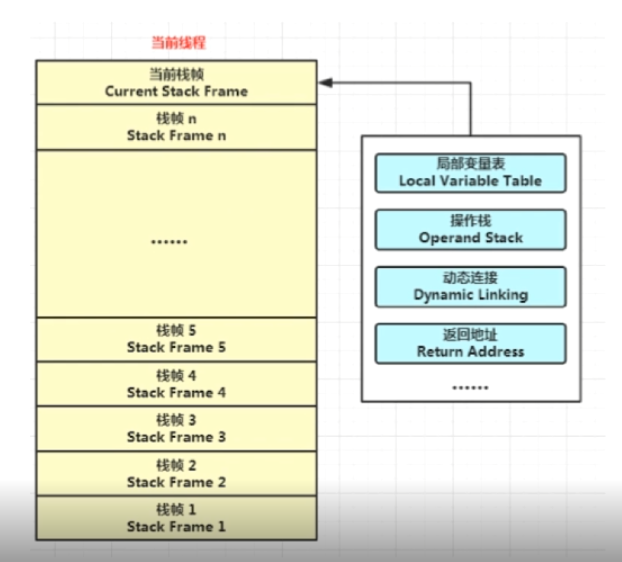

[TOC]

## 1.谈谈你对Java的理解
### 
- 平台无关性-一次编译到处运行
- GC垃圾回收机制
- 语言特性 泛型、反射、拉姆达表达式
- 面向对象 封装、继承、多态
- 类库
- 异常处理


## 2.平台无关性如何实现？
### 为什么要先将java代码转为.class字节码再有JVM在不同平台转为机器码执行？
- 因为将java代码转为.class字节码时已经检查了代码的语法、语义等，再执行时候无需再次检查校验或补全，可以提高性能
- 兼容性：可以将其他语言解析成字节码，增加平台的兼容性
- 如何查看字节码  javap 

## 3. JVM如何加载class文件
### Java虚拟机 
- 屏蔽底层操作系统的差异
- JVM内存解析模型
- GC 
- 内存中的虚拟机

### JVM组成部分
- Class Loader：依据特定格式，加载class文件到内存中
- Execution Engine：对命令进行解析
- Native Interface：融合不同开发语言的原生库为Java所用，Native方法是用非Java语言如C语言实现的。
- Runtime Data Area

## 4. 什么是反射
### 概念
- Java反射机制是在运行状态中，对任意一个类，都能够知道这个类的所有属性和方法；对任意一个对象，都能够调用它的任意方法和属性；这种动态获取信息以及动态调用对象的方法的功能称为Java语言的反射机制。

### 写一个反射的例子
- 就是将Java中的方法，字段等获取到




## 5. 谈谈ClassLoader
### 类从编译到执行的过程
- 编译器将Robot.java源文件便以为Robot.class字节码文件
- ClassLoader将字节码转换为JVM中的Class<Robot>对象
- JVM利用Class<Robot>对象实例化为Robot对象

### 什么是ClassLoder
- ClassLoader在Java中有着非常重要的作用，它主要工作在Class装载的加载阶段，其主要作用是从系统外部获得Class二进制数据流。它是Java的核心组件，所有的Class都是由ClassLoader进行加载的，ClassLoader负责通过将Class文件里的二进制数据流装载进操作系统，然后交给Java虚拟机进行连接、初始化等操作。
### ClassLoader的种类（主要有4类）
- BootStrapClassLoader：C++编写，加载核心库java.*
- ExtClassLoader:java编写，加载扩展类Javax.*
- AppClassLoader:java编写，加载程序所在目录
- 自定义ClassLoader:java编写，定制化加载

### 自定义ClassLoader的实现
- 关键函数
    - findClass
    - defineClass

## 6. ClassLoader的双亲委派机制
### 逐级向上查找，再逐级向下查找

### 为什么要使用双亲委派机制去加载类
- 避免多份同样字节码的加载

## 7. LoadClass和forName的区别

### 类的加载方式
- 隐式加载： new
- 显示加载： loadClass，forName等

### loadClass和forName的区别
- 类的装载过程
    - 1.加载：通过ClassLoader加载class文件字节码，生成Class对象
    - 2.链接： 分为校验、准备、解析3个过程
    - 初始化：执行类变量赋值和静态代码块
#### 相同点
- 都能在运行时知道任意一个类的所有属性和方法

#### 不同点
- Class.forName得到的class是已经初始化完成的
- ClassLoader.loadClass得到的class是还没有链接的
##### 作用
- 连接MySQL时就要用forName.因为Driver里面有一段static代码段
- 使用ClassLoader实现延迟加载

## 8. Java内存模型之线程独占部分-1

### 你了解Java内存模型吗？
#### 内存简介
- 在程序执行过程中需要不断将物理地址和虚拟地址做映射
- 32位处理器：2<sup>32</sup>的可寻址范围
- 64位处理器：2<sup>64</sup>的可寻址范围
#### 地址空间的划分
- 内核空间
- 用户空间
#### JVM内存模型-JDK8

- 程序计数器
    - 当前线程所执行的字节码行号指示器（逻辑）
    - 改变计数器的值来选取下一条需要执行的字节码指令
    - 和线程是一对一的关系即“线程私有”
    - 对Java方法计数，如果是Native方法则计数器值为Undefined
    - 不会发生内存泄漏
- Java虚拟机栈

    - Java方法执行的内存模型
    - 包含多个栈帧 
- 线程私有： 程序计数器、虚拟机栈、本地方法栈
- 线程共享：MetaSpace、Java堆
##### 局部变量表和操作数栈
- 局部变量表：包含方法执行过程中的所有变量
- 操作数栈：入栈、出栈、复制、交换、产生消费变量


## 9. Java内存模型之线程独占部分-2

###执行add(1,2)

### 递归为什么会引发java.lang.StackOverflowError异常？
- 递归过深，栈帧数超出虚拟栈深度
- 可使用迭代替换递归
- 虚拟机栈过多会引发java.lang.OutOfMemoryError

### 工具：JStack

## 10.Java内存模型之线程共享部分
### 元空间（MetaSpace）与永久代（PermGen）的区别
- 元空间使用本地内存，而永久代使用的是jvm的内存--解决了空间不足的问题

### MateSpace相比PermGen的优势
- 字符串常量池存在永久代中，容易出现性能问题和内存溢出
- 类和方法的信息大小难以确定，给永久代的大小指定带来困难
- 永久代会为GC带来不必要的复杂性
- 方便HotSpot与其他JVM如Jrockit的集成

### Java堆（Heap）
- 对象实例的分配区域
- GC管理的主要区域

## 11.Java内存模型之常考题解析-1 和  12.Java内存模型之常考题解析-2 
### JVM三大性能调优参数 -Xms  -Xmx  -Xss的含义
>  使用如下指令执行程序时可以传入JVM参数
> java -Xms128m -Xmx128m -Xss256k -jar xxxx.jar

- Xss:规定了每个线程虚拟机栈（堆栈）的大小
- Xms:堆的初始值
- Xmx: 堆能达到的最大值
- 一般将 -Xms 和 -Xmx 设置成一样大，因为在扩容时会产生内存抖动

### Java内存模型中堆和栈的区别---内存分配策略
- 静态存储：编译时确定每个数据目标在运行时的存储空间需求
- 栈式存储： 动态存储，数据区需求在编译时未知，运行时模块入口前确定，按照先进后出分配
- 堆式存储： 编译时或运行时模块入口都无法确定，动态分配，比如可变长度串和对象实例，由大片可利用块或空闲块组成，堆中内存可按任意顺序分配和释放
- 联系： 引用对象、数组时，栈里定义变量保存堆中目标的首地址
- 区别:
    - 管理方式：栈自动释放，堆需要GC
    - 空间大小： 栈比堆小
    - 碎片相关： 栈产生的碎片远小于堆
    - 分配方式： 栈支持静态和动态分配，而堆仅支持动态分配
    - 效率： 栈的效率比堆高

### 元空间、堆、线程独占部分间的联系-内存角度

### 不同JDK版本之间的intern()方法的区别---- JDK6 VS JDK6+
```java
String s = new String("a");
s.intern();
```
- JDK6:当调用intern方法时，如果字符串常量池先前已创建出该字符串对象，则返回池中的该字符串的引用。否则，将此字符串对象添加到字符串常量池中，并返回该字符串对象的引用。
- JDK6+ ：当调用intern方法时，如果字符串常量池先前已创建出该字符串对象，则返回池中该字符串的引用。否则，如果该字符串对象已经存在于Java堆中，则将堆中对此对象的引用添加到字符串常量池中，并且返回该引用；如果堆中不存在，则在池中创建该字符串并返回其引用。

[intern详解](http://cyc2018.gitee.io/cs-notes/#/notes/Java%20%E5%9F%BA%E7%A1%80?id=%E4%B8%8D%E5%8F%AF%E5%8F%98%E7%9A%84%E5%A5%BD%E5%A4%84)

